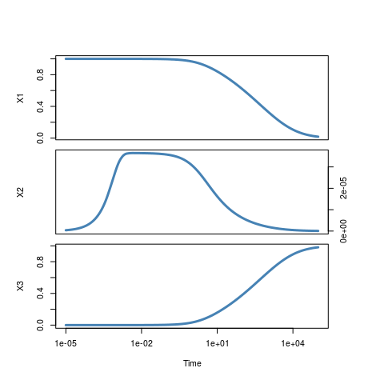
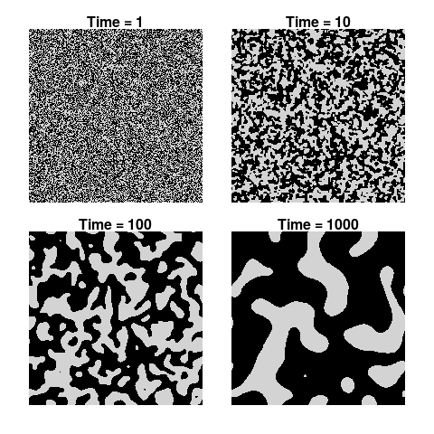

# odeintr
Timothy H. Keitt  
`r format(Sys.time(), '%d %B, %Y')`  

[](https://travis-ci.org/thk686/odeintr) [](http://www.r-pkg.org/badges/version/odeintr) [](http://cran.rstudio.com/web/packages/odeintr/index.html)

The odeintr is package for integrating differential equations in R. The integration engine is
the [Boost odeint package](http://www.odeint.com).

### Features

1. Simple specification of the ODE system
1. Named, dynamic run-time setable system parameters
1. Intelligent defaults, easily overridden, used throughout
1. A wide range of integration methods available for compiled system (see [stepper types](http://www.boost.org/doc/libs/1_58_0/libs/numeric/odeint/doc/html/boost_numeric_odeint/odeint_in_detail/steppers.html#boost_numeric_odeint.odeint_in_detail.steppers.stepper_overview))
1. Fully automated compilation of ODE system specified in C++
1. Simple openmp vectorization of large systems
1. Results returned as a simple data frame ready for analysis and plotting
1. Ability to specify a custom observer in R that can return arbitrary data
1. Three options for calling the observer: at regular intervals, after each update step or at specified times
1. Ability to alter system state and restart simulations where you left off
1. Can compile an implicit solver with symbolic evaluation of the Jacobian
1. You can easily save and edit the generated C++ code

### Installation

```
install.packages(odeintr)                   # released
devtools::install_github("thk686/odeintr")  # development
```

There have been some problems compiling on Windows owing to an incompatibility between
the `BH` package and `RTools` toolchain. I have removed the dependency on the `BH`
package. If you have trouble with Windows, please try the development version.

### Examples


```r
library(odeintr)
dxdt = function(x, t) x * (1 - x)
system.time({x = integrate_sys(dxdt, 0.001, 15, 0.01)})
```

```
##    user  system elapsed 
##   0.104   0.000   0.104
```

```r
plot(x, type = "l", lwd = 3, col = "steelblue", main = "Logistic Growth")
```

 

```r
compile_sys("logistic", "dxdt = x * (1 - x)")
system.time({x = logistic(0.001, 15, 0.01)})
```

```
##    user  system elapsed 
##   0.000   0.000   0.001
```

```r
plot(x, type = "l", lwd = "3", col = "steelblue", main = "Logistic Growth")
points(logistic_at(0.001, sort(runif(10, 0, 15)), 0.01), col = "darkred")
```

 


```r
dxdt = function(x, t) c(x[1] - x[1] * x[2], x[1] * x[2] - x[2])
obs = function(x, t) c(Prey = x[1], Predator = x[2], Ratio = x[1] / x[2])
system.time({x = integrate_sys(dxdt, rep(2, 2), 20, 0.01, observer = obs)})
```

```
##    user  system elapsed 
##   0.184   0.000   0.182
```

```r
plot(x[, c(2, 3)], type = "l", lwd = 2, col = "steelblue", main = "Lotka-Volterra Phase Plot")
```

 

```r
plot(x[, c(1, 4)], type = "l", lwd = 2, col = "steelblue", main = "Prey-Predator Ratio")
```

 


```r
# C++ code
Lorenz.sys = '
  dxdt[0] = 10.0 * (x[1] - x[0]);
  dxdt[1] = 28.0 * x[0] - x[1] - x[0] * x[2];
  dxdt[2] = -8.0 / 3.0 * x[2] + x[0] * x[1];
  ' # Lorenz.sys
compile_sys("lorenz", Lorenz.sys)
system.time({x = lorenz(rep(1, 3), 100, 0.001)})
```

```
##    user  system elapsed 
##   0.012   0.004   0.019
```

```r
plot(x[, c(2, 4)], type = 'l', col = "steelblue", main = "Lorenz Attractor")
```

 


```r
VdP.sys = '
dxdt[0] = x[1];
dxdt[1] = 2.0 * (1 - x[0] * x[0]) * x[1] - x[0];
' # Vdp.sys
compile_sys("vanderpol", VdP.sys, method = "bsd") # Bulirsch-Stoer
system.time({x = vanderpol(rep(1e-4, 2), 100, 0.01)})
```

```
##    user  system elapsed 
##   0.004   0.000   0.002
```

```r
par(mfrow = c(2, 2), mar = rep(0.5, 4), oma = rep(5, 4), xpd = NA)
make.plot = function(xy, xlab = NA, ylab = NA)
  plot(xy, col = "steelblue", lwd = 2, type = "l",
       axes = FALSE, xlab = xlab, ylab = ylab)
plot.new()
make.plot(x[, c(3, 1)]); axis(3); axis(4)
make.plot(x[, c(1, 2)], "Time", "X1"); axis(1); axis(2)
make.plot(x[, c(3, 2)], "X2"); axis(1); axis(4)
title(main = "Van der Pol Oscillator", outer = TRUE)
```

 


```r
# Use a dynamic parameter
VdP.sys = '
dxdt[0] = x[1];
dxdt[1] = mu * (1 - x[0] * x[0]) * x[1] - x[0];
' # Vdp.sys
compile_sys("vpol2", VdP.sys, "mu", method = "bsd")
par(mfrow = c(2, 2), mar = rep(1, 4), oma = rep(3, 4), xpd = NA)
for (mu in seq(0.5, 2, len = 4))
{
  vpol2_set_params(mu = mu)
  x = vpol2(rep(1e-4, 2), 100, 0.01)
  make.plot(x[, 2:3]); box()
  title(paste("mu =", round(mu, 2)))
}
title("Van der Pol Oscillator Parameter Sweep", outer = TRUE)
title(xlab = "X1", ylab = "X2", line = 0, outer = TRUE)
```

 


```r
# Stiff example from odeint docs
Stiff.sys = '
  dxdt[0] = -101.0 * x[0] - 100.0 * x[1];
  dxdt[1] = x[0];
' # Stiff.sys
cat(JacobianCpp(Stiff.sys))
```

```
## J(0, 0) = -101;
## J(0, 1) = -100;
## J(1, 0) = 1;
## J(1, 1) = 0;
## dfdt[0] = 0.0;
## dfdt[1] = 0.0;
```

```r
compile_implicit("stiff", Stiff.sys)
x = stiff(c(2, 1), 5, 0.001)
plot(x[, 1:2], type = "l", lwd = 2, col = "steelblue")
lines(x[, c(1, 3)], lwd = 2, col = "darkred")
```

 


```r
# Robertson chemical kinetics problem
Robertson = '
dxdt[0] = -alpha * x[0] + beta * x[1] * x[2];
dxdt[1] = alpha * x[0] - beta * x[1] * x[2] - gamma * x[1] * x[1];
dxdt[2] = gamma * x[1] * x[1];
' # Robertson
pars = c(alpha = 0.04, beta = 1e4, gamma = 3e7)
init.cond = c(1, 0, 0)
cat(JacobianCpp(Robertson))
```

```
## J(0, 0) = -alpha;
## J(0, 1) = beta * x[2];
## J(0, 2) = beta * x[1];
## J(1, 0) = alpha;
## J(1, 1) = -(beta * x[2] + (gamma * x[1] + gamma * x[1]));
## J(1, 2) = -(beta * x[1]);
## J(2, 0) = 0;
## J(2, 1) = gamma * x[1] + gamma * x[1];
## J(2, 2) = 0;
## dfdt[0] = 0.0;
## dfdt[1] = 0.0;
## dfdt[2] = 0.0;
```

```r
compile_implicit("robertson", Robertson, pars, TRUE)
at = 10 ^ seq(-5, 5, len = 400)
x = robertson_at(init.cond, at)
par(mfrow = c(3, 1), mar = rep(0.5, 4), oma = rep(5, 4), xpd = NA)
plot(x[, 1:2], type = "l", lwd = 3,
     col = "steelblue", log = "x", axes = F, xlab = NA)
axis(2); box()
plot(x[, c(1, 3)], type = "l", lwd = 3,
     col = "steelblue", log = "x", axes = F, xlab = NA)
axis(4); box()
plot(x[, c(1, 4)], type = "l", lwd = 3,
     col = "steelblue", log = "x", axes = F)
axis(2); axis(1); box()
```

 


```r
# reaction-diffusion model with openmp
# M is defined as std::sqrt(N)
# laplace2D is built into the template
# Note that openmp can be slower
# It requires tuning
M = 200
bistable = '
#pragma omp parallel for
for (int i = 0; i < M; ++i)
  for (int j = 0; j < M; ++j)
    dxdt[i * M + j] = D * laplace2D(x, i, j) +
      a * x[i * M + j] * (1 - x[i * M + j]) * (x[i * M + j] - b);
' # bistable
compile_sys_openmp("bistable", bistable, sys_dim = M * M,
                   pars = c(D = 0.1, a = 1.0, b = 1/2),
                   const = TRUE)
at = 10 ^ (0:3)
inic = rbinom(M * M, 1, 1/2)
system.time({x = bistable_at(inic, at)})
```

```
##    user  system elapsed 
## 194.372   0.036  42.529
```

```r
par(mfrow = rep(2, 2), mar = rep(1, 4), oma = rep(1, 4))
for (i in 1:4){
  image(matrix(unlist(x[i, -1]), M, M),
        asp = 1, col = c("black", "lightgray"),
        axes = FALSE)
  title(main=paste("Time =", x[i, 1]))}
```

 

### Performance

Because ODEINT is a header-only library, the entire integration path is exposed to the compiler. That means your system functions can be inlined with the integration code, loops unrolled, etc. It will help if you enable optimization in your compiler. Use "-O3" with gcc. See the R documentation on the user Makevars file. (Odeintr now provides a convenient function to set the compiler
optimization level.)

The Lorenz  and Van der Pol examples above show about 10 million observer calls per second.

### To Do

1. ~~Add additional integration methods from odeint~~
1. ~~Extend customized observer to compiled code~~
1. ~~Allow user to set error tolerances in compiled code~~
1. ~~Allow user to set error tolerances for system defined in R~~
1. ~~Expose implicit solver methods~~
1. ~~Compute Jacobian symbolically~~
1. ~~Convenient dynamic parameter settings~~
1. ~~Install emitted function in a new environment~~
1. Add more control of openmp threading

Pull requests are welcome.

