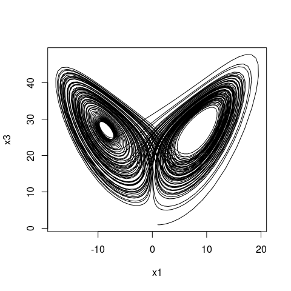

# odeintr
Timothy H. Keitt  
04/17/2015  

The odeintr is package for integrating differential equations in R. The integration engine is
the [Boost ODEINT package](http://www.odeint.com). Some important features:

1. You can specify your system in C++ and odeintr will compile and link custom integrator
2. If you define your system in R code, you can provide a custom observer function that can record arbitrary information after each integration step

Some examples:

```r
library(odeintr)
sys = function(x, t) x * (1 - x)
y = integrate_sys(sys, 0.001, 20)
plot(y, type = "l")
```

 

```r
sys = function(x, t) c(x[1] - x[1] * x[2], x[1] * x[2] - x[2])
obs = function(x, t) c(Prey = x[1], Predator = x[2])
y = integrate_sys(sys, rep(2, 2), 20, observer = obs)
plot(y[, c(2, 3)], type = "l")
```

 

```r
# C++ code
Lorenz.globals = '
  const double sigma_ = 10.0;
  const double R_ = 28.0;
  const double b_ = 8.0 / 3.0;
' # Lorenz.globals
Lorenz.sys = '
  dxdt[0] = sigma_ * (x[1] - x[0]);
  dxdt[1] = R_ * x[0] - x[1] - x[0] * x[2];
  dxdt[2] = -b_ * x[2] + x[0] * x[1];
  ' # Lorenz.sys
compile_sys("lorenz", Lorenz.sys, Lorenz.globals)
x = lorenz(rep(1, 3), 100)
plot(x[, c(2, 4)], type = 'l')
```

 

One of the main reasons the compiled code has the potential to be very fast is that ODEINT is a header-only library, so the entire integration path is exposed to the compiler. That means your system functions can be inlined with the integration code, loops unrolled, etc. It will help if you enable optimziation in your compiler. Use "-O3" with gcc. See the R documentation on the user Makevars file.

### To Do

The current code is incomplete. It would be great to wrap other features of the ODEINT library. A good start would be to support calling the observer function at specified times. This simply means calling other integration functions in ODEINT (e.g., integrate_const). There are also many other integration methods in ODEINT beyond the default Dorman-Prince 5th order method used in this package.
